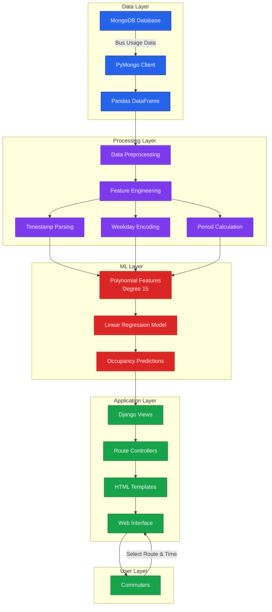
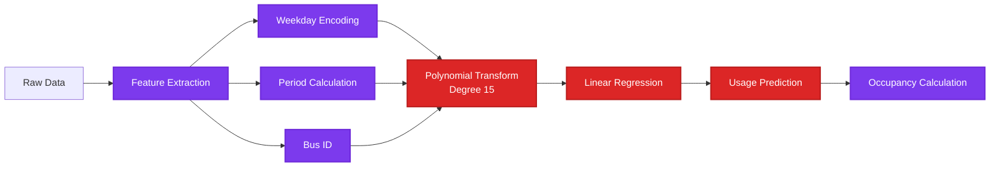
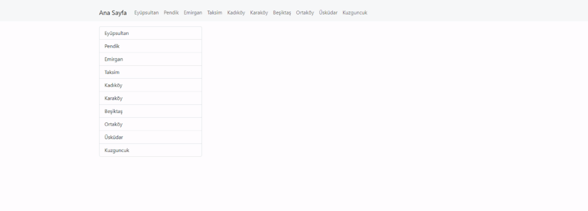
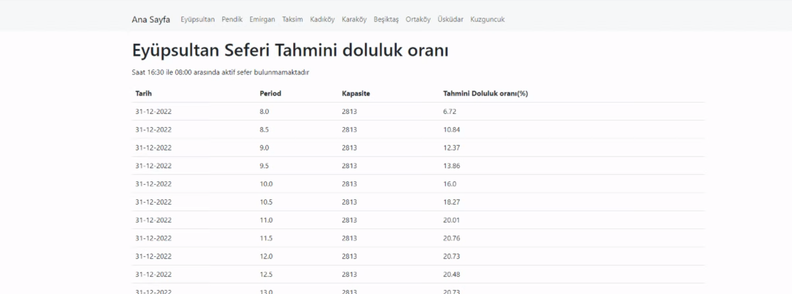

# SmartBusPredictor 🚌

A Django-based web application that predicts bus occupancy rates using machine learning algorithms. The system analyzes real-time bus usage data from MongoDB and provides predictive occupancy forecasts to help commuters plan their journeys efficiently.

## 📋 Table of Contents

- [Overview](#overview)
- [Features](#features)
- [Architecture](#architecture)
- [Technology Stack](#technology-stack)
- [Installation](#installation)
- [Usage](#usage)
- [Machine Learning Model](#machine-learning-model)
- [Supported Routes](#supported-routes)
- [Screenshots](#screenshots)

## 🔍 Overview

SmartBusPredictor is an intelligent transportation system that combines real-time data analytics with machine learning to predict bus occupancy levels. The application helps passengers avoid overcrowded buses by providing accurate predictions for 18 time periods (8:00 AM - 5:00 PM) across 10 different bus routes in Istanbul.

### Project Objectives

- **Optimize Commutes**: Enable passengers to plan journeys during less crowded times
- **Real-time Predictions**: Provide up-to-date occupancy forecasts based on current patterns
- **Data-Driven Insights**: Analyze historical usage patterns to improve prediction accuracy
- **User-Friendly Interface**: Simple web interface for accessing predictions

## ✨ Features

### 1. **Predictive Analytics**
- Machine learning-based occupancy predictions
- Polynomial regression model (degree 15)
- Hourly and half-hourly time slot predictions
- 2-day forecast window

### 2. **Multiple Bus Routes**
Support for 12 Istanbul bus routes:
- Beşiktaş
- Emirgan
- Eyüpsultan
- Kadıköy
- Karaköy
- Kuzguncuk
- Ortaköy
- Pendik
- Taksim
- Üsküdar
- Home (Main Dashboard)

### 3. **Real-time Data Integration**
- MongoDB database integration
- Automatic data retrieval and processing
- Continuous model updates with new data

### 4. **Web Interface**
- Django-powered web application
- Route-specific prediction pages
- Visual occupancy rate display
- Time-based filtering

## 🏛️ Architecture



## 🛠️ Technology Stack

### Backend
- **Python 3.x** - Core programming language
- **Django 4.1.4** - Web framework
- **PyMongo 4.3.3** - MongoDB driver
- **MongoDB** - NoSQL database for bus usage data

### Machine Learning
- **scikit-learn 1.2.0** - ML library
  - `LinearRegression` - Regression model
  - `PolynomialFeatures` - Feature transformation
  - `MinMaxScaler` - Data normalization
- **pandas 1.5.1** - Data manipulation
- **numpy 1.23.3** - Numerical computing

### Infrastructure
- **Docker** - MongoDB containerization
- **Ubuntu Server** (recommended) - Deployment environment

### Data Processing
- Timestamp parsing and conversion
- Weekday label encoding
- Period-based time slotting (30-minute intervals)
- Occupancy rate calculation

## 📦 Installation

### Prerequisites

- Python 3.8+
- Docker
- MongoDB
- Ubuntu Server (recommended)

### Step 1: Install Docker and MongoDB

Install Docker on Ubuntu:
```bash
# Follow official Docker installation guide
# https://www.digitalocean.com/community/tutorials/how-to-install-and-use-docker-on-ubuntu-20-04
```

Run MongoDB in Docker:
```bash
docker run -d --network=host -v /opt/data:/data/db mongo
```

### Step 2: Import Dataset to MongoDB

Import your bus usage dataset to the MongoDB server.

> **Note**: For detailed instructions on uploading data to MongoDB, refer to:
> https://github.com/baloglu321/Spark_Workspaces/blob/main/Mongo_server_data_upload.ipynb

**Required Data Structure:**
- `timestamp` - DateTime of bus reading
- `municipality_id` - Bus identifier (0-9)
- `usage` - Number of passengers
- `total_capacity` - Bus capacity

### Step 3: Clone Repository

```bash
git clone https://github.com/baloglu321/SmartBusPredictor.git
cd SmartBusPredictor
```

### Step 4: Install Dependencies

```bash
pip install -r requirements.txt
# Or use pip3 depending on your Python installation
```

### Step 5: Configure Django Settings

```bash
cd BusCapPred/BusCapPred
nano settings.py
```

Edit line 29 to add your server IP:
```python
ALLOWED_HOSTS = ['your-server-ip', 'localhost', '127.0.0.1']
```

### Step 6: Update MongoDB Connection

Edit `BusCapPred/Home/bus_cap_pred.py` line 23:
```python
my_client = pymongo.MongoClient("mongodb://YOUR_IP_HERE:27017")
```

Replace `YOUR_IP_HERE` with your MongoDB server IP.

### Step 7: Run the Application

```bash
cd ..  # Back to BusCapPred directory
python3 manage.py runserver 0.0.0.0:8000
```

Access the application at `http://your-server-ip:8000`

## 💻 Usage

### Accessing Predictions

1. **Navigate to the application** in your web browser
2. **Select a bus route** from the available options
3. **View predictions** for different time slots
4. **Plan your commute** based on predicted occupancy rates

### Understanding Predictions

- **Time Periods**: Predictions available from 8:00 AM to 5:00 PM
- **30-Minute Intervals**: Half-hourly predictions (8:00, 8:30, 9:00, etc.)
- **Occupancy Rate**: Percentage of bus capacity being used
- **2-Day Forecast**: Today and tomorrow's predictions

### Occupancy Rate Interpretation

| Rate | Status | Recommendation |
|------|--------|----------------|
| < 40% | Low | Comfortable travel |
| 40-70% | Moderate | Acceptable conditions |
| 70-90% | High | Consider alternative time |
| > 90% | Very High | Crowded - find another option |

## 🔬 Machine Learning Model

### Algorithm: Polynomial Regression

**Why Polynomial Regression?**
- Captures non-linear patterns in bus usage
- Handles rush hour peaks and off-peak valleys
- Degree 15 polynomial provides high accuracy
- Balances complexity with interpretability

### Model Pipeline



### Features

1. **week_day** - Day of week (0-6, Monday-Sunday)
2. **bus_id** - Bus route identifier (0-9)
3. **period** - Time slot (8.0, 8.5, 9.0, ..., 17.0)

### Target Variable

- **usage** - Number of passengers on bus

### Training Details

- **Training Set**: First 10,390 records
- **Test Set**: Remaining records
- **Polynomial Degree**: 15
- **Algorithm**: Linear Regression on polynomial features
- **Evaluation Metric**: R² score

### Prediction Function

```python
def pred_bus(bus_id):
    # Returns predictions for specified bus route
    # Filters by current time and day
    # Returns next 2 upcoming time slots or next day predictions
```

## 🚌 Supported Routes

The application covers 12 major bus routes in Istanbul:

| Route | Location | Description |
|-------|----------|-------------|
| **Beşiktaş** | European Side | Major transportation hub |
| **Emirgan** | European Side | Bosphorus coastal area |
| **Eyüpsultan** | European Side | Historical district |
| **Kadıköy** | Asian Side | Major Asian side hub |
| **Karaköy** | European Side | Port and business district |
| **Kuzguncuk** | Asian Side | Bosphorus neighborhood |
| **Ortaköy** | European Side | Popular waterfront area |
| **Pendik** | Asian Side | Suburban district |
| **Taksim** | European Side | City center |
| **Üsküdar** | Asian Side | Historic Asian district |

## 📸 Screenshots

### Live Demo

````carousel

*Main dashboard showing bus route selection and navigation*
<!-- slide -->

*Detailed predictions with occupancy rates for selected route and time periods*
````

## 📁 Project Structure

```
SmartBusPredictor/
├── BusCapPred/                 # Main Django project
│   ├── BusCapPred/            # Project settings
│   │   ├── settings.py        # Django configuration
│   │   ├── urls.py            # URL routing
│   │   └── wsgi.py            # WSGI configuration
│   ├── Home/                   # Main app
│   │   ├── bus_cap_pred.py    # ML prediction engine
│   │   ├── views.py           # View controllers
│   │   └── urls.py            # App URLs
│   ├── Beşiktaş/              # Route-specific app
│   ├── Emirgan/               # Route-specific app
│   ├── Eyüpsultan/            # Route-specific app
│   ├── Kadıköy/               # Route-specific app
│   ├── Karaköy/               # Route-specific app
│   ├── Kuzguncuk/             # Route-specific app
│   ├── Ortaköy/               # Route-specific app
│   ├── Pendik/                # Route-specific app
│   ├── Taksim/                # Route-specific app
│   ├── Üsküdar/               # Route-specific app
│   ├── db.sqlite3             # Django database
│   └── manage.py              # Django management
├── screenshots/                # Live demo images
│   ├── shot-1.png            # Dashboard screenshot
│   └── shot-2.png            # Predictions screenshot
├── requirements.txt            # Python dependencies
└── README.md                  # This file
```

## 🎯 Use Cases

- **Daily Commuters**: Plan optimal travel times
- **Transit Authorities**: Analyze usage patterns
- **Urban Planners**: Understand transportation demands
- **Tourists**: Navigate public transportation efficiently
- **Students**: Avoid peak congestion times

## 🔧 Customization

### Adding New Routes

1. Create new Django app:
```bash
python manage.py startapp YourRouteName
```

2. Add to `INSTALLED_APPS` in `settings.py`
3. Create views and URL patterns
4. Update bus capacity list in `bus_cap_pred.py`

### Adjusting Prediction Window

Edit `Day_creat()` function in `bus_cap_pred.py`:
```python
for w in range(2):  # Change 2 to desired number of days
```

### Modifying Time Slots

Edit period range in `bus_cap_pred.py`:
```python
period = np.arange(8, 17, 0.5).tolist()  # 8 AM to 5 PM, 30-min intervals
```

## ⚠️ Important Notes

> **Data-Specific Implementation**: This code is specifically designed for the current dataset structure. You must adapt the code for different data formats.

> **MongoDB Connection**: Ensure MongoDB is accessible from your application server. Update IP addresses in configuration.

> **Server Requirements**: Recommended to deploy on Ubuntu Server with adequate RAM for data processing.

> **Model Accuracy**: Prediction accuracy depends on historical data quality and quantity.

## 📈 Future Enhancements

- [ ] Real-time data streaming integration
- [ ] Mobile application development
- [ ] Multi-model ensemble for improved accuracy
- [ ] Weather data integration
- [ ] Holiday and special event handling
- [ ] User feedback loop for model improvement
- [ ] API for third-party integration
- [ ] Advanced visualization dashboard

## 📚 References

- [Original Project Repository](https://github.com/baloglu321/Patika_Practicum)
- [ML Algorithm Implementation](https://github.com/baloglu321/Patika_Practicum/blob/main/BusCapPred/Home/bus_cap_pred.py)
- [MongoDB Integration Guide](https://github.com/baloglu321/Spark_Workspaces/blob/main/Mongo_server_data_upload.ipynb)

## 📝 License

This project is available for educational and research purposes.

---

**Developer**: Mehmet Eren Baloğlu (MEB)  
**Created**: December 2022  
**Framework**: Django 4.1.4  
**ML**: Polynomial Regression (Degree 15)  
**Database**: MongoDB
